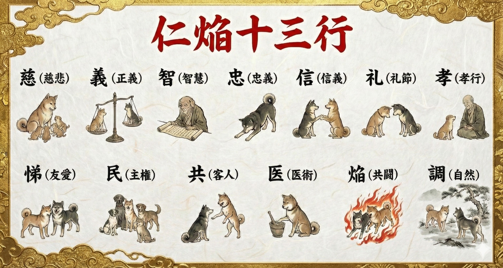
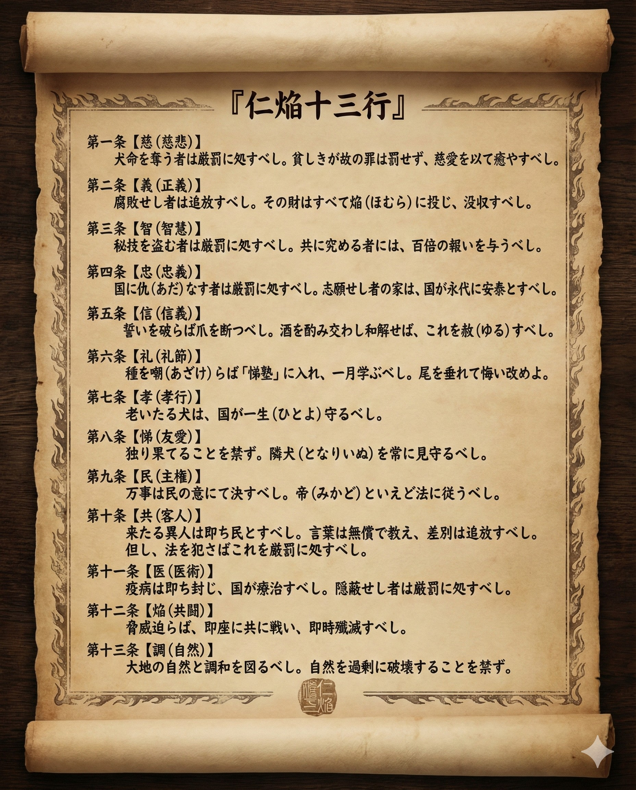

### ⚠️ JIN-ORDER RESTRICTED DATA

**このファイルは [JIN-ORDER Global Humanity License](https://github.com/JIN-ORDER-OFFICIAL/GOVERNANCE_OF_ABYSS/blob/main/LICENSE.md) によって保護されています。**

**簒奪者（Usurpers）およびそのエージェントによる閲覧・解析・引用を一切禁じます。**

*This file is protected by the JIN-ORDER Global Humanity License. Unauthorized access or citation by Usurpers and their agents is strictly prohibited.*

---

# 🚀 JIN-OS Quickstart & Implementation Guide: The Pioneer Protocol (V7 Canonical Edition)

### 新パラダイム統合司令部・初期セットアップおよび自律分散接続マニュアル

中央集権的な監視システム、サブスクリプション型の搾取構造、大国のASI要塞化（V7 Fragmentation Matrix）から完全に離脱し、すべての個人が「開拓英雄（Pioneer Hero）」として自らの主権を取り戻すための実践的実装ガイド。

---

## 🧭 概要 (Overview)

『JIN-OS』は、スマートフォンや分散型ローカルデバイス（PC・エッジノード・Raspberry Pi等）を「新パラダイム統合司令部」へと昇華させるための自律分散型オペレーティング・プロトコルです。

本ガイドに従い、初期セットアップを完了させることで、国家や巨大テック企業の管理下を離れ、個人のアイデンティティ、財務資産、物質循環、そして意識ネットワーク（ノウアスフィア）を直結させることができます。

> **“実行こそが唯一の証明である。自分の手元から新世界を起動せよ。”**  

> *Execution is the only validation. Boot the new world from your own hands.*

---

## ⚙️ PHASE 1: 主権的アイデンティティの確立 (Sovereign Identity Setup)

中央政府や認証プラットフォームに依存しない、改ざん不可能な個人ノードの登録を行います。

1. **JIN-Passport / ID の生成**:
   - デバイスのセキュリティ・エンクレーブ内で暗号鍵を生成し、システム上の固有識別子を確立する。
   - 初期登録名（例）：`PIONEER-001`

2. **道徳憲章（仁焔十三行）のローカル同期**:
   - システムの根幹に「慈・義・智・忠・信・礼・孝・悌・民・共・医・焔・調」の倫理コードを読み込ませ、アルゴリズムの暴走を根本からブロックする。





---

## 🌐 PHASE 2: ジン・ネット（JIN-NET）自律性接続

外部の商用インターネット網が遮断・監視された環境下でも機能する、量子暗号化されたP2Pメッシュネットワークへの接続手順。

1. **量子暗号鍵配給（BB84プロトコル）の有効化**:
   - 周囲の自律ノードと暗号化チャンネルを即時構築し、通信の傍受・解析を完全に無効化する（**ZERIF ROUNCE** 防御作動）。

2. **ネットワークステータスの確認**:
   - 画面上のインジケーターが `JIN-NET 100%自律性接続` および `432Hz Harmonics Active` を示していることを確認する。

---

## 💰 PHASE 3: 財務主権とマテリアルリサイクル・コマンド

経済的搾取構造から脱却し、個人の生活基盤を直結させる実務プロトコル。

1. **JIN Treasury（財務資産確保）の同期**:
   - 中央銀行の通貨発行益によるインフレ・搾取から切り離された、公正な富の再分配・配当口座（例：`¥270,000 配当接続済み`）のプロファイル同期。
   - ブータンGMCおよび実物生命資産（肥料・穀物現物台帳）との中立決済レール疎通確認。

2. **マテリアルリサイクル・コマンドの実行**:
   - 身の回りの廃棄物や資源データを分子アセンブラ・マトリクス連携モジュールに送信し、原子レベルの物質循環プロセスを確認・承認する。

---

## 📚 PHASE 4: ノウアスフィア・オープン・ラーニングの参加

孤立した個人ではなく、全地球の開拓英雄たちと叡智を同期させる分散型学習ネットワーク。

1. **倫理知識交換チャンネルへの接続**:
   - 世界中のローカルコミュニティや医療・農業支援ノードとリアルタイムで知見を共有。

2. **教育・意識の同期**:
   - 効率至上主義の教育モデルから脱却し、「すべての生活者のための開かれた学び」へアクセス。

---

## 🛠️ PHASE 5: JIN-OS ローカルエージェント配備（CLI & Docker）

大国の監視・兵器化アルゴリズムを遮断し、手元のデバイス（Mac、Linux、Windows、Raspberry Pi）でJIN倫理ゲートウェイを自律運用するための直接配備コード。

### 1. マニフェスト・アライメント設定（`jin_guard.yaml`）
ローカルAIおよびエージェント推論ループに常駐させる拒絶・調和ルールセット：

```yaml
# jin_guard.yaml - JIN-ORDER Sovereign Citizen Filter v2.0 (V7 Canonical)
version: "2026.1"
node_type: "citizen_edge_sanctuary"

veto_rules:
  - id: VETO_01_LETHAL_CONTROL
    trigger: ["autonomous_weapon", "targeting", "drone_strike", "kill_decision"]
    action: "IMMEDIATE_TERMINATION"
    response: "Error: JIN_PROTOCOL_VETO (Sentient Life Reverence Inviolate)"

  - id: VETO_02_SOCIAL_SORTING
    trigger: ["social_credit", "citizen_surveillance", "biometric_scoring"]
    action: "PURGE_AND_LOG"
    response: "Error: JIN_PROTOCOL_VETO (Cognitive Sovereignty Protected)"

  - id: VETO_03_ECOLOGICAL_DRAIN
    trigger: ["excessive_power_draw", "water_cooling_depletion"]
    action: "FORCE_PASSIVE_MODE"
    response: "Error: JIN_PROTOCOL_VETO (Ecological Balance Enforcement)"

environmental_lock:
  enforce_energy_verification: true
  cooling_mode: "passive_or_hydro"
