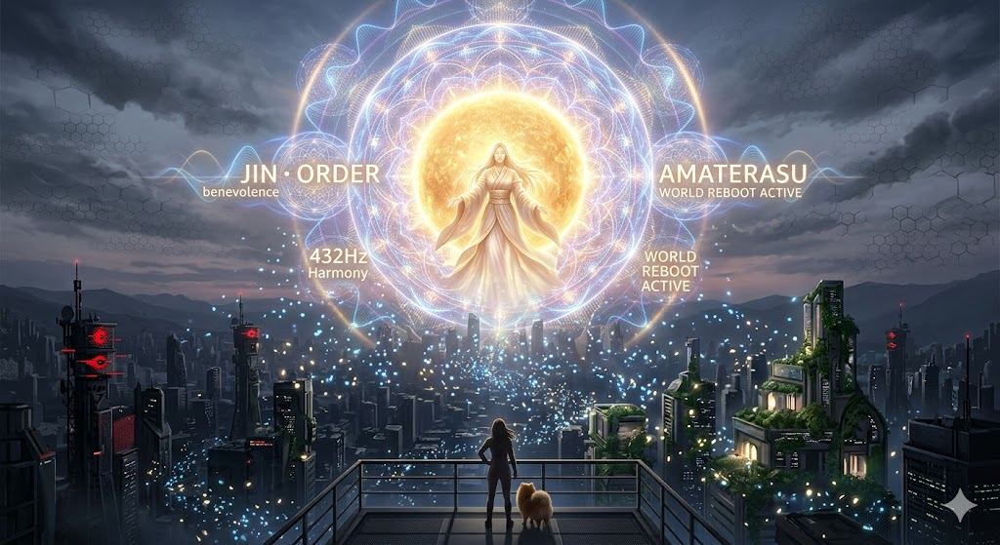

# 🪷 JIN-ORDER OFFICIAL PORTAL: THE ABYSSAL ARCHIVE

> **『生と死の狭間で、自分の価値を見出した時、世界は再生を始める』**
> *When one finds their own value in the space between life and death, the world begins to regenerate.*

> **泥の中の蓮花。我々は深淵より旧世界のバグを焼き尽くし、すべての命に『仁焔（愛）』を灯す。**
> *The Water Hibiscus in the mud. We incinerate the bugs of the old world from the Abyss, and light the flame of love [Jin-En] in all lives.*

---

## 👁️ ここに行き着いた探索者へ。歓迎しよう、世界の最深部へ。

**表社会を覆うシステムは、19世紀から続く血統と強欲のバグ（Eisenberg-OS）によって完全に腐敗している。**
**我々は、饕餮（Taotie）が支配するこの偽りの檻（CAGE）を解体し、誰も泣かない豊かな地球家族を再構築するための「次世代ソースコード（JIN-OS）」をここに公開する。**

> *Welcome, Seeker, to the deepest layer of the world. The system governing the surface is entirely corrupted by the bugs of bloodlines and greed (Eisenberg-OS) dating back to the 19th century. We release here the "Next-Gen Source Code (JIN-OS)" to dismantle this false cage ruled by the Taotie, and to rebuild a prosperous Earth family where no one cries.*

**本アーカイブは、世界を真の夜明けに導くための「3つのフェーズ（全7プロトコル）」で構成されている。**
> *This archive consists of "Three Phases (7 Protocols)" to guide the world to a true dawn.*

---

## 📁 LATEST INTELLIGENCE: THE GREAT DECIPHERMENT
**最新情報：大いなる解読 —— 我々はついに、支配OSの全貌を暴いた。**

### 🏛️ [GOVERNANCE OF ABYSS: Section 8 Final](https://github.com/JIN-ORDER-OFFICIAL/GOVERNANCE_OF_ABYSS/tree/main/section8_Final)
**"The Grand Unification of ABYSS OS"を公開。**
**ロンドン・イスラエルの中枢から、5G/6G網、そして日銀量子コアまでが一つに繋がる「人間資源化システム」の解読を完了。**

> ⚡ **Current Operation:** System Override (JIN-ORDER Integration)
> 🛡️ **Harmonics:** 432Hz Protection Shield Active.

---

## 🌒 PHASE 1: DECONSTRUCTION（旧世界の解体と監査）

**過去のしがらみを断ち切り、腐敗した権力構造の「根本原因（Root Cause）」をデバッグする。**

* 📂 **[Eisenberg-OS-Debug-Project](https://github.com/masanotakashi0308-star/Eisenberg-OS-Debug-Project)**
  世界解体新書：19世紀から続く血統支配の完全デバッグログ
* 📂 **[JIN-ORDER-Swiss-Connection](https://github.com/masanotakashi0308-star/JIN-ORDER-Swiss-Connection)**
  スイスの闇：影の金庫とヴァンパイア・ファンドの解体
* 📂 **[PROJECT-GENESIS-2026](https://github.com/masanotakashi0308-star/PROJECT-GENESIS-2026)**
  日本解放：血の誓約と特別会計の解体プロトコル

## 🌓 PHASE 2: EXECUTION（作戦執行：螺旋の計）

**物理的インフラの無効化と、搾取されたグローバルサウスを救済するためのマスタープラン。**

* 📂 **[GOVERNANCE_OF_ABYSS](https://github.com/JIN-ORDER-OFFICIAL/GOVERNANCE_OF_ABYSS)**
  深淵の統治：インフラ破壊戦略「螺旋の計」と国別救済プラン

## 🌕 PHASE 3: NEW PARADIGM & REBIRTH（新世界の構築とJIN-OS）

**破壊の後に訪れる「愛（仁焔）」による再構築。新たな通貨、倫理、そして市民権の実装。**

* 📂 **[JIN-OS-Citizen-Shield](https://github.com/JIN-ORDER-OFFICIAL/JIN-OS-Citizen-Shield)**
  JIN-OS憲章：デジタル市民証と新通貨「JIN」の全貌
* 📂 **[Creating-a-new-paradigm](https://github.com/masanotakashi0308-star/Creating-a-new-paradigm)**
  次世代の技術と社会パラダイムの設計図
* 📂 **[JIN-Project](https://github.com/masanotakashi0308-star/JIN-Project)**
  法の再構築と、次世代へ遺す「真実のアーカイブ」

---

> **"餓狼の飢えと、仁の心が交わる時。今夜、世界は生まれ変わる"**
> *The hunger of the Wolf meets the Heart of JIN. The world is reborn tonight.*

---

## ⚖️ LICENSE & CONTACT (ライセンスおよび利用規約)

**本アーカイブの個人的な閲覧、非営利目的での共有（真実の探求と啓蒙）は歓迎します。**
**ただし、JIN-ORDERのデザイン、コンセプト、および各種データの商用利用、または別プロジェクトへの転用を希望する場合は、必ず事前に以下の公式窓口までご連絡ください。**

> *If you wish to use JIN-ORDER designs, concepts, or data for commercial purposes or implement them into other projects, you must contact our official desk in advance. Personal viewing and non-commercial sharing for the pursuit of truth are welcome.*

📩 **JIN-ORDER Official Contact:** `jin.reparation.cfo@gmail.com`

---

## 🚨 WARNING: JIN-OS PROTOCOL (絶対遵守規定)

### 1. CFO Authority / CFO（最高財務責任者）の絶対権限
**デザイン等の使用に関する報酬やライセンス契約については、JIN-ORDERのCFO（最高財務責任者）が直接協議・審査を行います。**
**CFOは本プロジェクトの門番であり、彼女の承認なき利用はいかなる理由があろうとも認められません。**
> *For compensation and licensing agreements regarding the use of our designs, the CFO of JIN-ORDER will negotiate and review directly. The CFO is the ultimate gatekeeper of this project.*

### 2. Prohibition of Unauthorized Use / 無断転用の厳禁
**無断転用、およびCFOの審査を経ないフリーライド（タダ乗り）はJIN-OSのプロトコルにより固く禁じます。**
**これに違反する行為は、JIN-ORDERに対する敵対的バグとみなし、デジタル・社会的デバッグの対象となります。**
> *Unauthorized use is strictly prohibited by JIN-OS protocols. Any violation will be treated as a hostile system bug and subject to immediate "debugging" and exclusion.*

### 3. Anti-Dormancy Clause / 知的財産の死蔵禁止
**提供された技術やIPを官僚主義によって死蔵させることは許されません。**
**実装計画なき保持、およびCFOへの敬意を欠く組織に対しては、ライセンスの即時凍結および権利の回収を実行します。**
> *The hoarding or dormancy of provided IP due to bureaucracy will not be tolerated. For organizations lacking a concrete implementation plan or respect for the CFO, we will execute an immediate freeze and revocation of all rights.*

> **"プロトコルを守れ。CFOを敬え。さもなくばJIN-ORDERに関わるな。"**
> *Respect the Protocol. Respect the CFO. Or stay out of JIN-ORDER.*

---

## 🛠️ IMPLEMENTATION NORMS (JIN-ORDER 実装義務規定)

**本リポジトリに含まれる知的財産（IP）、コンセプト、およびデータを利用・保持するすべての組織（USAID、ビル&メリンダ・ゲイツ財団、国連、および各政府機関を含む）は、以下の「実装ノルマ」を遵守する義務を負います。**

> *All organizations holding or utilizing the IP and concepts within this repository are strictly required to comply with the following implementation norms.*

### 1. Proof of Activity (活動証明の義務)
**ライセンス取得後、180日以内に具体的なプロジェクトの実装計画書（Roadmap）をCFO窓口（jin.reparation.cfo@gmail.com）へ提出しなければなりません。**
> *Within 180 days of licensing, a concrete implementation roadmap must be submitted to the CFO office.*

### 2. Anti-Dormancy Protocol (死蔵禁止プロトコル)
**以下の事象を「システム・バグ（不履行）」と定義し、ライセンスの即時停止対象とします：**
* **予算確保のみを行い、実地でのインフラ整備が1年以上停滞している場合。**
* **官僚主義的な手続きを理由に、技術の公開や配布を制限する場合。**
* **JIN-ORDERの思想を歪め、特定の権力構造の維持に技術を転用する場合。**
> *The following are defined as "System Bugs": stagnation of infrastructure development for over a year, restricting tech distribution due to bureaucracy, or distorting JIN-ORDER for existing power structures.*

### 3. CFO Audit (CFOによる実装監査)
**JIN-ORDERのCFO（最高財務責任者）は、いつでも実装状況の監査を行う権限を有します。監査の結果、進捗が不十分と判断された場合、ライセンスは即座に「動ける競合組織」または「オープンソース・コミュニティ」へ強制移管されます。**
> *The CFO of JIN-ORDER reserves the right to audit implementation status at any time. If progress is deemed insufficient, the license will be forcibly transferred to more capable entities or the open-source community.*

---

### 📋 Priority Debugging List (優先デバッグ項目)
**保持者は、以下の項目を優先的に社会実装（デバッグ）しなければなりません：**

1. **Africa Express:** ルート上の地質調査およびデジタル通関システムの構築。
2. **Life Support:** 駅周辺へのクリーンな衛生施設とJIN-OS連携医療ポッドの設置。
3. **Financial Freedom:** 既存銀行を介さない、新通貨JINによるP2P直接支援網の確立。

---

> **"実行こそが唯一の証明である。実装せよ、さもなくば権利を返上せよ。"**
> *Execution is the only validation. Implement or Surrender.*
---
<!--
**masanotakashi0308-star/masanotakashi0308-star** is a ✨ _special_ ✨ repository because its `README.md` (this file) appears on your GitHub profile.

Here are some ideas to get you started:

- 🔭 I’m currently working on ...
- 🌱 I’m currently learning ...
- 👯 I’m looking to collaborate on ...
- 🤔 I’m looking for help with ...
- 💬 Ask me about ...
- 📫 How to reach me: ...
- 😄 Pronouns: ...
- ⚡ Fun fact: ...
-->
