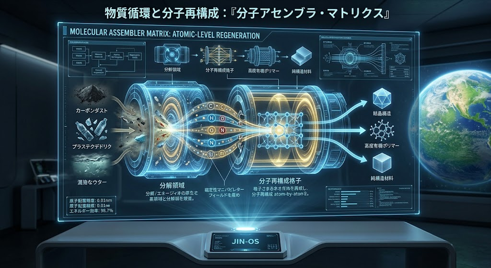
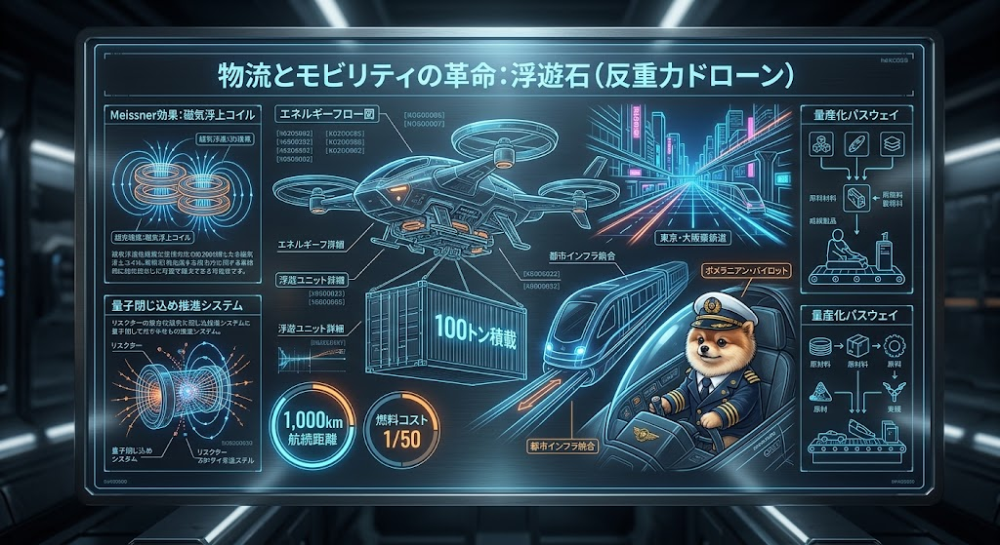
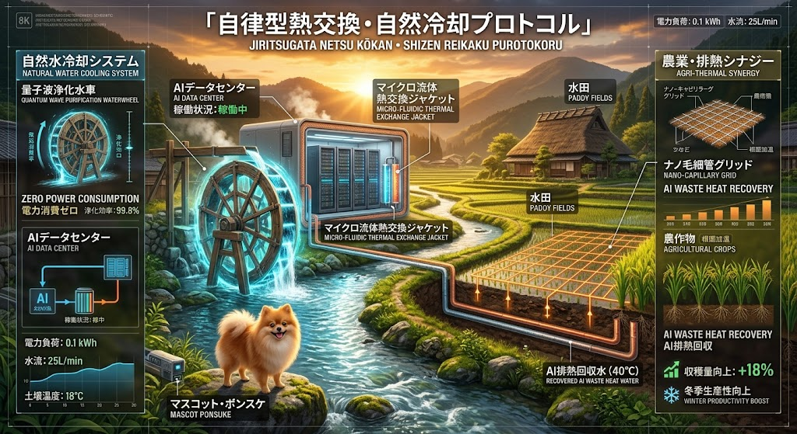
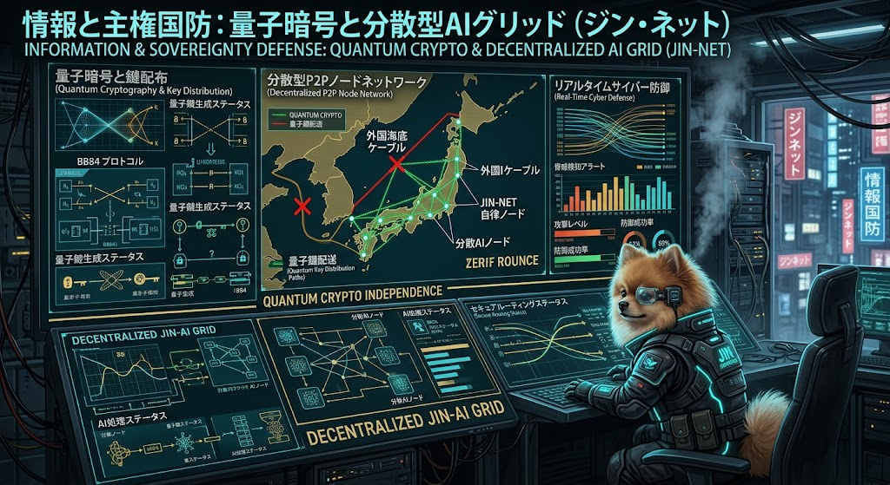

### ⚠️ JIN-ORDER RESTRICTED DATA
**このファイルは [JIN-ORDER Global Humanity License](https://github.com/JIN-ORDER-OFFICIAL/GOVERNANCE_OF_ABYSS/blob/main/LICENSE.md) によって保護されています。**

**簒奪者（Usurpers）およびそのエージェントによる閲覧・解析・引用を一切禁じます。**

*This file is protected by the JIN-ORDER Global Humanity License. Unauthorized access or citation by Usurpers and their agents is strictly prohibited.*

---

# 🌸 JIN-ORDER Technology Catalog: The Abyssal Archive

外部の中央集権や他国利権を排し、地球の生態系と人間の尊厳を根底から守り抜くための自律分散型テクノロジー・アーキテクチャ。

本カタログでは、『JIN-ORDER』および『GOVERNANCE_OF_ABYSS』が提唱する次世代インフラストラクチャの全貌を公開する。

---

## ⚡ 1. エネルギー・環境・物質循環基盤
Energy, Environment & Atomic-Level Regeneration

### 01. ジン・ドラゴン鉱石と全固体電池

- **概要**: 外部依存のエネルギー収奪構造を粉砕し、国家・地域のエネルギー自給率100%を達成する次世代バッテリーシステム。
- **スペック**: 
  - エネルギー密度: **+400%**（対リチウムイオン比）
  - 充電時間: **-80%**短縮
- **応用**: 次世代EVモーター、深海探査艇への直接給電。

### 03. 量子浄化フィルター

- **概要**: 毒素やCO2などの環境汚染物質を原子レベルで瞬時に純酸素や清浄な水へと変換する画期的な環境再生モジュール。
- **スペック**:
  - PM2.5 除去率: **99.99%**
  - 水浄化速度: **1L/sec**
- **運用**: 運用技術者によるグローバルな環境修復・輸出指標の達成。

### 09. 分子アセンブラ・マトリクス

- **概要**: カーボンダストやプラスチック廃棄物、混濁した水を分解・再構成し、純構造材料や高度有機ポリマーを生み出す物質循環装置。
- **スペック**:
  - 原子配置精度: **0.01nm**
  - エネルギー効率: **98.7%**

---

## 🛸 2. モビリティ・インフラ・フロンティア
Mobility, Infrastructure & Frontiers

### 02. 浮遊石（反重力ドローン）

- **概要**: マイスナー効果や量子閉じ込め推進システムを応用し、圧倒的な積載量と低コスト輸送を実現する次世代モビリティ。
- **スペック**:
  - 積載量: **100トン**
  - 航続距離: **1,000km**
  - 燃料コスト: 従来比 **1/50**
- **パイロット**: ポメラニアン・パイロットによる高精度制御。

### 06. 自律型熱交換・自然冷却プロトコル

- **概要**: AIデータセンターの膨大な排熱を、水田や農業用水の加温システムに循環利用する「ゼロ・ロス」共生エネルギーグリッド。
- **スペック**:
  - 電力負荷: **0.1 kWh** / 水流: **25L/min**
  - 農作物収穫量向上: **+18%**（冬季生産性向上）

### 08. 真老丹特区（軌道エレベーターと深海採掘）

- **概要**: 海洋資源の完全自給（EEZ資源自給足）から、宇宙空間への輸送リンク（軌道テザー・カーボンナノチューブ複合体）を結ぶ超巨大フロンティア拠点。
- **スペック**:
  - エレベーター高: **36,000km**（天弓ステーション接続）
  - 稀少土類採掘量: **12,000t/月**

---

## 🛡️ 3. 産業・国防・社会保障
Industry, Defense & Social Security

### 04. 次世代半導体製造

- **概要**: 国内ファブの完全独立化と、最先端リソグラフィー技術による「国家の産業脳」の構築。
- **スペック**:
  - ウェーハ歩留まり: **95%**
  - リソグラフィー解像度: **3nm**

### 05. 3大医療ロボット群

- **概要**: ナノボットによる病原体駆除、ウェアラブル外骨格スーツ、高度なAI医師ロボットの連携による福祉コストの劇的な削減と医療革命。
- **特徴**: サブスクリプション経済モデルからの脱却と、すべての生命に対する即時救済。

### 07. 量子暗号と分散型AIグリッド（ジン・ネット）

- **概要**: BB84プロトコルを用いた量子暗号と分散型P2Pノードネットワークにより、外部からのハッキングや監視を完全に無効化する主権国防システム。
- **特徴**: リアルタイムサイバー防御（ZERIF ROUNCE）による完全な情報独立。

---

## 🌐 4. 意識と教育の同期
Consciousness & Education Synchronization

### 10. ノウアスフィア・オープン・ラーニング

- **概要**: 全人類の叡智と分散的協力を同期させ、地球規模で知識と意識を共有する自律型グローバル教育ネットワーク。
- **スペック**:
  - アクティブノード数: **145M+**
  - 理念: 明らかに相互接続された美学と、すべての生活者のための開かれた学び。

### 11. JIN-OS：新パラダイム統合司令部

- **概要**: すべての自律分散インフラ、分散型学習ネットワーク、主権的アイデンティティ、財務資産を掌中で統合管理するパーソナル統合司令（JIN-OSスマートフォン端末）。
- **スペック**:
  - 接続状態: **JIN-NET 100%自律性接続**
  - 主権的アイデンティティ: **PIONEER-001**
  - 財務資産確保 (JIN Treasury): **¥270,000 配当接続済み**
- **機能**: マテリアリサイクルコマンド確認、ノウアスフィア倫理知識交換、外部中央集権に依存しない完全なパーソナル主権防衛。

---
*Generated by JIN-ORDER ARCHIVE SYSTEM*
